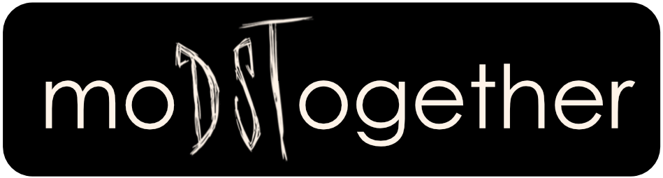

### (1) Scenario section needs you! (2) Think your project/discord/group could be featured meaningfully, contribute, or constitute a resource and be acknowledged fully? Reach out! Don't wait, im keeping busy, not looking to spam anyone, and I'd like your permission. (3) I would rather not do this alone (4) use raposo.ryan@gmail.com OR use issues :) 


<p align="center">
  <a href="" rel="noopener">
 </a>
</p>

- [Acknowledgements](#acknowledgements)
- [FAQ](#faq)
- [Installing Git](#installing-git)
- [Getting Started](#getting-started)
- [Moving Forward](#moving-forward)
  - [Branches](#branches)
  - [How do I know if I'm getting it?](#how-do-i-know-if-im-getting-it)
  - [Scenarios & How-To's](#scenarios--how-tos)
- [Tools](#tools)
  - [modops](#modops)
  - [nstald](#nstald)
  - [sumlua](#sumlua)
- [Find a Team](#find-a-team)
  - [Mod Owners](#mod-owners)
  - [Modders](#modders)
- [Contact](#contact)

## FAQ

**Q: Do I have to surrender control of my project to collaborate?**

No. All situations where any amount of control is given to another require specific, additional steps from you. By default, you always make the final call on changes. We'll go over options related to permissions, including keeping total control, or using protected branches to find an ideal setup with contributors you identify.

**Q: I don't have a project, or I just want to help. Am I in the wrong place?**

No, but after reading the FAQ you might want to skip to [Moving Forward](#moving-forward). It can never hurt to familiarize yourself with processes your team members are responsible for, though. Especially if they're learning. 

**Q: I just read section x, I have a better idea.**

Great news! I hope you have [time](#contact), also.

**Q: I had trouble with the format of the guide at times. What now?**

If the pace is wrong, or the tone somewhere in this guide isn't relevant to you, I'm sorry. I want to help people who struggle with the same feelings I have to this day. Thats the place I can speak from. Coding and having people to be excited about it with saved my life. Modding let me feel at home. Squabbling over certain tech or tech culture is just a non-consideration vs. my intention to give people where I'm from in life a shortcut ASAP. That said I hope they can enjoy the luxury like me one day, and I really do enjoy it. Don't touch my setup.

On a less serious note, I'm commited to it because supplementing existing tutorials on this subject is a hard! I do hope there is something in the project for you. 

**Q: Isn't GitHub only for open source projects?**

No. You could put a project (even public) on GitHub that people are not allowed to use, let alone modify or distrubute.

**Q: Okay, so I'm clear on things in legal terms. But I kinda still want to keep development private. Can I still collaborate?**

Yes, I'll explain how, and I want to take this opportunity to validate your decision to do that. There *is* a consideration that the open-source community, license drafters, and courts do not and cannot reasonably weigh in on: your feeling on things. Do not let current discussion have you feeling that your decision to share your passion with other people is actually, in the end, a step in the wrong direction. Are there benefits to public repositories? I think so, and they will be discussed and leveraged here but *moDSTogether* is still for you if you choose to make yours private. No sweat.

I love open-source! But this project is meant to help you feel comfortable and equipped to work with others - not accelerate you into the hyper-transparent software economy of 2090.  

**Q: Do I have to use the template (or anything else)?**

If you decide you'd like to include this document, please include it in it's entirety, with any name and in any location within the repository. 

Everything else can be used in part, as a whole, or not at all. I've included each in the form and arrangement they exist because I believe they'll be helpful for specific reasons, in both the individual and community context- but you don't need to use anything. 

**Q: Sometimes I start a git tutorial, and everything is great. But then I think about making a mistake, or a commitment I might regret, or added stress. This is because I'm aware I might not get it quite as well as is apparent, being a rational person. Do you feel me?**

Yes, I do feel you.

But you're in my heart and we can do this. If I'm setting out to do anything, it's check in on that possibility for the both of us, and give us a lifeline at every stage. If you screw up like me, you'll be looked after.

I'm doing my very best to ask 'Is this necessary?' before recommending or technical-naming *anything*. If something looks like jargon, keep your understanding. If you can live without the benefits of a certain step, do so, and then add me on Discord (ryanraposo #6339) and if I can, I'll help you make it work. That's what this is about.

**Q: Are there any restrictions?**

The project is supported by including this document, please include it in its entirety. You may rename it or move it anywhere within your repository. If you have ideas on how to improve it, please get in touch. moDSTogether is currently a non-commercial project.

Please also be respectful of Klei's guidelines surrounding mods. They deserve it. Note that Klei is not associated with this project.

## Installing Git

There are a few options for using git to track a project. Behind all of them is the same command-based system that you might be somewhat familiar with. Paired with a hosting option, a git-tracked project can extend those commands and its endless benefits to a team of any size. We'll be using GitHub to host ours. To use git itself, we need to set-up a few things on our machines.

There happens to be a desktop git solution made by GitHub: **[Github for Desktop](https://desktop.github.com/)**

This route isn't bad. I suggest we take it because:

- Graphical interface.
    
- We'll be using git with Github specifically, and its a git app... from and for Gitub. (It's worth noting again the difference between git and git hosts like Github. Git is to Github as porn is to Pornhub. There are other options like Gitlab, Bitbucket, etc.)
    
- It's aimed at people new to git who want to do exactly what we're trying to do: open a project up to a small team for colloaboration.
    
- Eventually you might find yourself using git via commands in a terminal. When you do, you'll recognize a lot of the commands from using this app. While it combines and obscures them a little bit for ease-of-use, it does a good job of building familiarity nonetheless.
    
- Being a user-friendly git app designed to work with github, its the best possible intro to the three main topics:
    
    - Git (the system)
    - Repositories (the thing git works upon/with. We're making a repository for our mod.)
    - Remotes (hosted repositories)

## Getting Started

This section assumes use of Github for Desktop, if you are using something else that won't be a problem as far as my offerings go. If, though, you have trouble with these steps in your setup, I highly recommend trying it out.

1. **Click 'Use this template'** (pictured below) to start your own repository with included tools, documentation, and file-structure to help jump-start collaboration on your mod.
   
   
* * *

2. **Finish creating your repository**. Note the image below. Feel free to make the repo public, but it isn't neccessary. It can be private and you will still be able to collaborate with others. You can always change this setting (as well as the name and description!) later on.

   
* * *

3. **Click "Clone or download"** in your newly generated repository, and then **"Open in Desktop"**.
    
    
* * *

4. **Click "Choose..." to select a folder** when Github for Desktop prompts you. In the image below, I chose a folder called *projects*. This is where the mod repo will be stored locally for you to work on.

   
* * *

5. **Copy the contents of your mod** (ex: anim, exported, scripts, modmain.lua, etc) into */mod*. Then open Github for Desktop and you will notice that these additions are listed as Changes.
   
   
* * *

7. **Type a commit message** then click **Commit to master**. Congratulations! You've made your first commit to the repository. It contained the addition of you mod files, and it established the **master branch**.

    
* * *

8. All thats left is to push this to Github. This last step is a moment to appreciate what git is about, and the job its being tasked with. It will strive to capture & reflect the changes you made wherever the repo may be, while tolerating time & version discrepancies across the team. When it can't, it shines even then by recognizing it and prompting a project member to settle what it couldn't confidently. 

## Moving Forward

### Branches


For this section, the goal is to ask why at each stage instead of how. There aren't any detailed instructions because more important is a draw for you to use multiple branches. If at the end it isn't there, I'm very interested in your feedback. I won't be listing benefits or selling the concept here.

Right now, our repository is based solely  in one branch: the *master* branch. We are going to use a workflow strategy based on one called Gitflow as we move forward.

In our *master* branch, we have the supporting items from moDSTogether and our mod, which ideally is in a state that reflects its most recent release. Its okay if not, but from here on the history of the *master* branch will be akin to a history of our releases to the Steam Workshop. Many commits to the repository will be made between and up to releases, but we won't be commiting them all directly to our central branch. 

We are going to create another branch immediately, based on the *master* branch called the *development* branch. When accumulative commits in this *development* branch warrant or represent a public update to the mod, it will merge back into the *master* branch, rolling in all the changes that make up the new release. This is how the *master* branch will remain symbolic of new versions in the Steam Workshop.

To keep things simple, we could say that development is going to involve adding new features, bug-fixes, and various other miscellaneous changes. When we want to get started on one of these, like adding a cool new item to the mod, we're going branch off of *development* with a short-lived but useful branch called something like: *cool-new-item*. When the new item is finished, it will be merged back into *development* (which makes it destined for the next release).

Consider these example patchnotes:

```
v0.7 "The Cool Stuff Update"
   - added the cool new item 
   - fixed a bug where items weren't rendering as cool as intended
   - added cool new skins for the cool new item
```

The first line would mirror a node in the commit history of our *master* branch. A version update.

The items below would represent those of our *development* branch, which contains the rolled-up work completed over the lives of our splintering feature branches, like *cool-new-item*. Commits in those feature/fix/change branches are just bread-and-butter git commits, which are not symbolic of anything in particular; they just represent progress for the dev working in the branch and the dev decides their nature when they enter their **commit message** with each one.

Now, don't spend too much time here. If nothing comes to mind, thats what you should take note of for these questions:

*Why merge when we do?*

*When we do, what would happen if we didn't?*

Let's go back to one branch:

*Who is responsible for deciding what our commits should represent?*

*How is that decided?*

*If we need to wheel things back, does the system serve me?*

*Do I always know if the code I'm working on is going to go anywhere or work?*

*Can I assume it won't while keeping the system?*

Any advantages, roadblocks, or hesitations are important after considering those questions. At this point, whichever path is more appealing, to **you**, is correct. Don't worry about any specific know-how just yet.

### How do I know if I'm getting it?

Trust that when your understanding is challenged, you can reconcile.

Git is a topic that can make us doubt that fact. It's a blackbox for most of us. That means its going to be described with and operate via a host of words we don't often use. Whats a commit? Its a precursor to a verb, or a meta-verb. Not very relevant to our experience and language, unless you're in law. But thats what a system with buffered, or stacked (or stashed or staged or proposed or indexed) actions needs to address when pulling the trigger on those actions is a mainstay. 

Your current understanding may not hold up to more experience, but until experience is a problem, you'll be okay. If git did only what social coding demanded, it would be so intuitive that we'd be modding together right now.

Git does not actively sustain your project. It doesn't destroy your project if called off. It just watches it, diligently enough to recreate, reenact, and recount. If we don't point it at important things, and tell it why we value them it will be useless. We can also define whats off-limits, and who has access. 

Perfect use doesn't exist, and our needs are humble. Advanced use is for advanced needs. To frame a dimension git is concerned with, think about Edit actions of a menu bar. CTRL+S could be described destructive, when you consider that CTRL+Z hinges on an unseen history of actions within most workspaces. If present git would boast warnings and a log around both, and wouldn't disengage when those shortcuts normally do. Normally intimidating, gits interface now looks like the asset it is.

Just know why you use each part of a command. Especially if its an 'f'. These options or flags can be the difference.

Bottom line:

*Git is excessive for a segment of my intended audience. If you're excited to really get into it, thats great! It's useful and enabling of teamwork. But be respectful of modders who are not so excited that it's part of finding a few friends who share a hobby. Its an unfortunate obstacle for them, if only for a time. Please teach (or hold back) where it would be helpful, and remember its a skill like any other. Many project owners would appreciate help with their source control responsibilities, but its often assumed on this platform.*

### Scenarios & How-To's

If you already have a mod/project on GitHub or similar, let me know your experiences (should be foreseeable for mod teams/our context). I’d like to cover different arrangements and there’s so much I don’t know.

This section is obviously critical. For those with advice or a perspective to share, here’s the format as I see it for now:

Unique setting - common, fundamental operation w UI/commands (breakdown of flags if applicable)

Example:

3 collaborators, 2 review req. reached - Merge Pull Request

+++ If a public link to view the setting, or additional background is doable! 

Input on setting factors that need to be covered is appreciated also. Thank you!

## Tools

### [modops](/tools/modops/README.md)
- An all-in-one panel of tools and automations for rapid deployment/debugging of Don't Starve Together mods.
- Useful stand-alone, or nested in moDSTogether-based projects for increased automation and integration.

### [nstald](/tools/nstald/README.md)
- Simple script that lists installed mods with their Workshop IDs/directory names.
- Useful stand-alone, or integrated by your other custom scripts (Python).

### [sumlua](/tools/sumlua/README.md)
- Lua to spreadsheet (.csv) converter that summarizes functions with columns for *Name*, *Parameters*, and *Scope*.
- Useful for making cheatsheets and pulling back the veil on Don't Starve Together's API.
- See output from consolecommands.lua & debugcommands.lua in /examples for good use-cases.

*Have tools/scripts of your own? I'd like to include them! (With full credit/linking, of course.)*

## Find a Team

**IMPORTANT:** No personal information allowed other than usernames, nicknames, or first names.

The project at (https://github.com/ryanraposo/moDSTogether) will use GitHub's Issues system to allow listings for mods, and those who want to help with them. 

### Mod Owners
Introuduce your mod [here.](https://github.com/ryanraposo/moDSTogether/issues/new?assignees=&labels=mod&template=introduce-your-mod-.md&title=%5BMOD%5D)

### Modders

Create a listing [here.](https://github.com/ryanraposo/moDSTogether/issues/new?assignees=&labels=modder&template=introduce-yourself--no-experience-required-.md&title=%5BWANT+TO+HELP%5D+title)

Note: If you're unsure about how you could help, post with *anything* you're good at, enjoy doing, or are interested in. No matter your background or experience, you have something that good mods need! I am making it my top priority in managing this project to help you figure out just what that is, and I invite other modders to do the same. The skills you don't have came later for many, many modders! 

## Contact
raposo.ryan@gmail.com for questions, comments, and inquiries of any kind, at any time. This includes owners of related resources and communities who would appreciate a mention or cooperation in some form. If you are aware of any communities outside of the typical who could find homes on mod teams, let me know. Artists, sound designers, etc. All of us were closer than we thought.

Always looking for: things to learn, people to learn them from, and opportunities to be useful. 

   **NOTE:** *The banner and consolecommands.csv & debugcommands.csv (found in tools/sumlua/examples) refer to and contain extracts of material created & owned by Klei Entertainment. This project is not affiliated or associated with Klei Entertainment. "Under Construction" gif by @jeffrey (giphy.com). No copyright infringement intended, will swiftly remove copyrighted content on request by respective owners.*
   
   All rights reserved. (Ryan Raposo)

